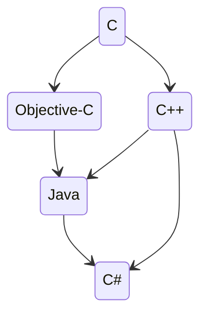

[Back](./readme.md)
# Introduction
**Week 1 - 2023-01-17**

## Why learn C
- Lot of existing C code
- Other languages have similar syntax
- C is perfect for operating systems and embedded systems
- Fast to execute, close to assembler speeds
- C has a very low runtime overhead
- Very small runtime, small memory footprint

**C is:**
- imperative: describes computation in terms of statements that change a programs state
- procedural/functional
- compiled
- statically typed: types are check before runtime
- weakly typed: supports implicit type conversions
- available on almost every platform, portable
- very fast
- explicitly memory managed
- ANSI/ISO standardised

**C does not have:**
- runtime error checking (bounds, initial values, etc.)
- sophisticated exception handling

```c
/* Hello world Program */       // Comment
#include <stdio.h>              // compiler directive

int main()                      // main function
{                               // start block/scope
    printf("Hello world!\n");   // output some text
    return 0;                   // finishe with success
}                               // end block/scope
```

# The C Family


# GNU: GNU's not Unix
Free, UNIX-compoatible operating system launched by Richard Stallman in 1983.

GNU system conttains all of the official GNU software packages, including **gcc**, the **GNU** **C**ompiler **C**ollection

> `gcc myProgram.c`

Compiles C program *myProgram.c* and links it to create executable *a.out*.

> `./a.out`

To run the program.

Standard compile:
> `gcc -ansi -c myProgram.c -o myProgram.o`

and link
> `gcc myProgram.o -o myProgram`

Object code *.o is **portable**, source is not required for linking.

Several objects can be linked together with
> `gcc myProgram.o mySubroutines.o -o myProgram`

# C standards
- K&R C: The original pre-ANSI/ISO standard defined by Kernighan and Ritchie.
- ANSI C: The first ANSI/ISO standard and still very widely used.
- C99: ISO standard from 1999
- C11: ISO standard from 2011 - the latest iteration.
- Embedded C: a parallel-track standard specifically for embedded systems.

# Program return values
```c
#include <stdio.h>

int main() // int means the function returns an integer.
{
    printf("Hello world!\n");
    return 0; // 0 => success, any other value => failure
}
```

# Variable declarations
C is **statically typed**
```c
int main ()
{
    /* declare some variables */
    int anInteger;              /* an integer */
    float aDecimal;             /* a floating point number */
    double someBigDecimal;      /* a big floating point number */
    char oneCharacter = 'X';    /* a single character, initialised */
    int anotherInteger = 4;     /* another integer, initialised */
    int an_old_school_variable_name;

    /* do some stuff */

    return 0;
}
```

| Data type    | Size    | Range    |
|---------------- | --------------- | --------------- |
| unsigned char    | 1 byte    | 0 to 255    |
| char    | 1 byte    | -128 to 127    |
| unsigned short int   | 2 bytes   | 0 to 65,535   |
| short int   | 2 bytes   | -32,768 to 32,767   |
| int | 4 bytes | -2,147,483,648 to 2,147,483,647 |
| long int | 8 bytes | $\pm 9\ \times\ 10^{18}$ |

| Type    | Size    | Smallest Value    | Largest Value   | Precision    |
|---------------- | --------------- | --------------- | --------------- | --------------- |
| float    | 4 bytes    | $\pm\ 3.4\ \times\ 10^{-38}$    | $\pm\ 3.4\ \times\ 10^{38}$    | 6 digits   |
| double   | 8 bytes   | $\pm\ 1.07\ \times\ 10^{-308}$   | $\pm\ 1.07\ \times\ 10^{308}$  | 15 digits   |
| long double | 16 bytes | $\pm\ 3.4\ \times\ 10^{-4932}$ | $\pm\ 3.4\ \times\ 10^{4932}$ | 18 digits |


# Data types: size and range
```c
#include <stdio.h>
#include <stddef.h>
#include <limits.h>
int main ()
{
    char elephants = 'E';
    printf("Min and max char: %d, %lu\n", CHAR_MIN, CHAR_MAX);
    printf("Number of bits: %d\n", CHAR_BIT);
    printf("Size of char (bytes): %lu\n", sizeof(char));
    printf("Size of elephants (bytes): %lu\n", sizeof(elephants));
    return 0;
}
```

# printf
## for char
```c
char aCharacter ;
char aNotherCharacter = 'X';
char nullCharacter = '\0';
char ch = '';
printf("aNotherCharacter = %c\n", aNotherCharacter);
// aNotherCharacter = X
printf("nullCharacter = *%c*\n", nullCharacter);
// nullCharacter = **
printf("character ch is *%c*\n", ch);
// character ch is **
printf("aCharacter = *%c*\n", aCharacter);
// Result is undefined
```

## for int
```c
int anInteger = 43;
printf("anInteger = |%d|\n", anInteger);
anInteger = |43|
printf("|%4d|\n", anInteger);
// | 43|
printf("|%04d|\n", anInteger);
// |0043|
printf("|%+d|\n", anInteger);
// |+43|
printf("|%+4d|\n", anInteger);
// | +43|
printf("|%1d|\n", anInteger);
// |43|

// long ints need the ”%ld” format specifier with ANSI C
```

## printf for float
```c
float f = 123.456789;
double d = 123.456789;
printf("|%f|\n", f);
// |123.456787|
printf("|%f|\n", d);
// |123.456789|
printf("|%10.2f|\n", d);
// | 123.46|
printf("|%010.2f|\n", d);
// |0000123.46|
printf("|%+010.2f|\n", d);
// |+000123.46|

// See also the “%g” format specifier which adjusts to the size of the number
```
## printf for big floats
```c
printf for big floats
long double bigNumber = 123456789.0123456567L;
printf("|%f|\n", bigNumber);
// |123.456789|
printf("|%Lf|\n", bigNumber);
// |123456789.012346|
printf("|%40.19Lf|\n", bigNumber);
// |˽˽˽˽˽˽˽˽˽˽˽123456789.0123456567889661528|
```


